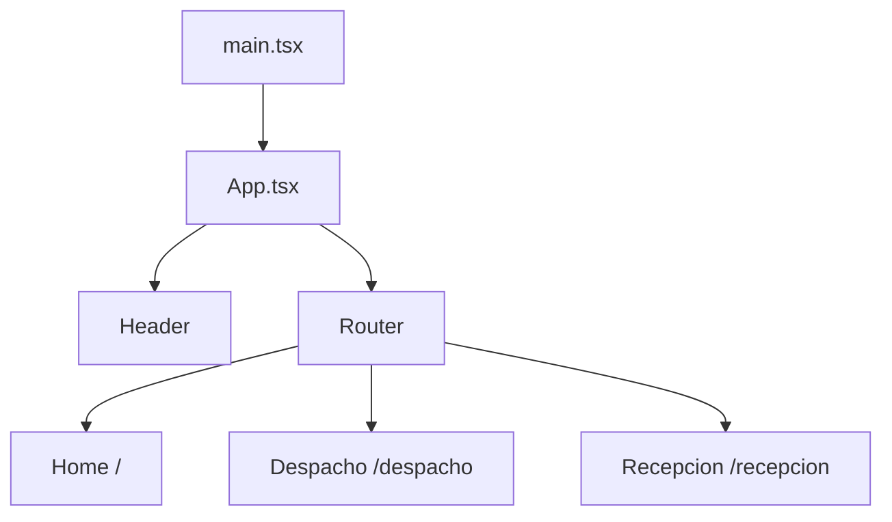

## Introduction

SUGO Front is a modern web application built with React 19 and Vite, designed for warehouse management operations. The application provides interfaces for reception (recepción) and dispatch (despacho) processes.

## Frontend Stack

### Core Technologies

<CardGroup cols={2}>
  <Card title="React 19" icon="react">
    Modern React with hooks and functional components
  </Card>
  <Card title="Vite" icon="bolt">
    Fast build tool and development server
  </Card>
  <Card title="TypeScript" icon="code">
    Type-safe development with strict mode enabled
  </Card>
  <Card title="React Router" icon="route">
    Client-side routing for SPA navigation
  </Card>
</CardGroup>

### UI Libraries

The application leverages multiple UI frameworks:

- **Bootstrap 5.3.8** - Core styling and layout system
- **PrimeReact 10.9.7** - Rich UI components for forms and data display
- **Bootstrap Icons** - Icon library for UI elements
- **FontAwesome** - Additional icon set

## Architecture Principles

### Component-Based Architecture

The application follows React's component-based architecture pattern:

- **Functional Components** - All components use modern React functional syntax
- **Hooks** - Custom hooks for reusable logic (located in `src/hooks/`)
- **Composition** - Components are composed to build complex UIs

### Single Page Application (SPA)

SUGO Front is built as a SPA with client-side routing:

- Fast navigation without full page reloads
- Shared header component across all routes
- Route-based code organization

### State Management Approach

<Info>
The application currently uses React's built-in state management with hooks. Custom hooks like `useHook.ts` and `useModulos.ts` encapsulate business logic and state.
</Info>

## Application Flow



### Entry Point

The application initializes in `src/main.tsx`:

1. Imports global styles (Bootstrap, PrimeReact, custom CSS)
2. Creates React root with `StrictMode`
3. Renders the main `App` component

### Routing Layer

The `App.tsx` component sets up the routing structure:

- Uses `BrowserRouter` for HTML5 history API
- Renders persistent `Header` component
- Defines three main routes

### Component Hierarchy

```
App (BrowserRouter)
├── Header (persistent)
└── Routes
    ├── / → Sugo_main
    ├── /despacho → FormularioDespacho
    └── /recepcion → FormularioRecepcion
```

## Build Configuration

### Vite Configuration

The application uses Vite for development and production builds:

<CodeGroup>

```typescript vite.config.ts
import { defineConfig } from "vite";
import react from "@vitejs/plugin-react";

export default defineConfig({
  plugins: [react()],
  server: {
    host: true,
    port: 5173,
    watch: {
      usePolling: true,
    },
  },
});
```

</CodeGroup>

**Key Features:**
- React plugin for JSX/TSX support
- Development server on port 5173
- Polling-based file watching (useful for Docker/VM environments)
- Host exposed for network access

### TypeScript Configuration

The project uses TypeScript with strict settings:

- **Target**: ES2022
- **Module**: ESNext with bundler resolution
- **JSX**: react-jsx (automatic runtime)
- **Strict mode**: Enabled with additional linting rules

### Build Scripts

```json
{
  "dev": "vite",                    // Development server
  "build": "tsc -b && vite build",  // Type check + production build
  "preview": "vite preview",        // Preview production build
  "lint": "eslint ."                // Code linting
}
```

## Development Workflow

<Steps>
  <Step title="Install Dependencies">
    Run `npm install` to install all required packages
  </Step>
  <Step title="Start Dev Server">
    Run `npm run dev` to start Vite development server on port 5173
  </Step>
  <Step title="Hot Module Replacement">
    Vite provides instant HMR for fast development feedback
  </Step>
  <Step title="Type Checking">
    TypeScript provides compile-time type safety
  </Step>
  <Step title="Build">
    Run `npm run build` for optimized production bundle
  </Step>
</Steps>

## Performance Considerations

- **Fast Refresh** - Vite's HMR preserves component state during development
- **Code Splitting** - Route-based code splitting via React Router
- **Optimized Builds** - Vite produces optimized production bundles
- **Modern Syntax** - ES2022 target for better performance in modern browsers

## Next Steps

<CardGroup cols={2}>
  <Card title="Project Structure" icon="folder-tree" href="/architecture/project-structure">
    Explore the codebase organization
  </Card>
  <Card title="Routing" icon="route" href="/architecture/routing">
    Learn about navigation and routing
  </Card>
</CardGroup>