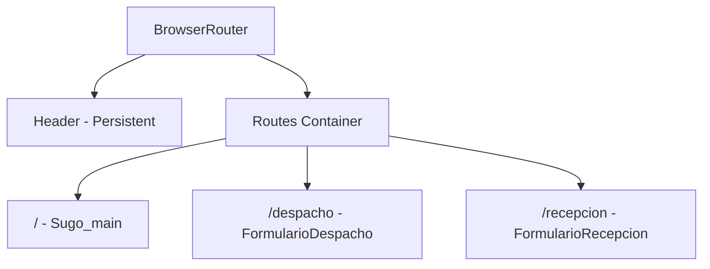

## Overview

SUGO Front uses **React Router v7** for client-side routing, implementing a single-page application (SPA) architecture with three main routes for home, dispatch, and reception operations.

## Router Setup

### Router Configuration

The routing is configured in `src/App.tsx` using `BrowserRouter`:

<CodeGroup>

```tsx src/App.tsx
import { BrowserRouter, Routes, Route } from "react-router-dom";
import { Header } from "./components/Header";
import { Sugo_main } from "./components/Sugo_main";
import { FormularioRecepcion } from "./Recepcion/FormularioRecepcion";
import { FormularioDespacho } from "./Despacho/FormularioDespacho";

export const App = () => {
  return (
    <BrowserRouter>
      <Header />
      <Routes>
        <Route path="/" element={<Sugo_main />} />
        <Route path="/despacho" element={<FormularioDespacho />} />
        <Route path="/recepcion" element={<FormularioRecepcion />} />
      </Routes>
    </BrowserRouter>
  );
};
```

</CodeGroup>

### Router Type

The application uses **BrowserRouter**, which:

- Uses HTML5 history API (`pushState`, `replaceState`)
- Creates clean URLs without hash (`#`) symbols
- Requires server configuration for production deployments
- Provides better SEO compared to HashRouter

<Info>
**BrowserRouter** is ideal for modern web apps but requires the server to serve `index.html` for all routes. Vite handles this automatically in development.
</Info>

## Route Definitions

### Application Routes

The application defines three main routes:

<CardGroup cols={3}>
  <Card title="Home" icon="house">
    **Path**: `/`  
    **Component**: `Sugo_main`  
    Landing page
  </Card>
  <Card title="Despacho" icon="box">
    **Path**: `/despacho`  
    **Component**: `FormularioDespacho`  
    Dispatch form
  </Card>
  <Card title="Recepción" icon="inbox">
    **Path**: `/recepcion`  
    **Component**: `FormularioRecepcion`  
    Reception form
  </Card>
</CardGroup>

### Route Structure



### Route Table

| Path | Component | Description | File Location |
|------|-----------|-------------|---------------|
| `/` | `Sugo_main` | Home/landing page | `src/components/Sugo_main.tsx` |
| `/despacho` | `FormularioDespacho` | Dispatch form interface | `src/Despacho/FormularioDespacho.tsx` |
| `/recepcion` | `FormularioRecepcion` | Reception form interface | `src/Recepcion/FormularioRecepcion.tsx` |

## Navigation Patterns

### Persistent Header

The `Header` component is rendered **outside** the `Routes` component, making it persistent across all routes:

```tsx
<BrowserRouter>
  <Header />  {/* Persistent - always visible */}
  <Routes>
    {/* Routes that change based on URL */}
  </Routes>
</BrowserRouter>
```

<Tip>
This pattern is ideal for navigation menus, headers, and footers that should remain visible during route transitions.
</Tip>

### Link Navigation

To navigate between routes, use React Router's `Link` component:

<CodeGroup>

```tsx Link Example
import { Link } from "react-router-dom";

// Navigation link
<Link to="/despacho">Ir a Despacho</Link>
<Link to="/recepcion">Ir a Recepción</Link>
<Link to="/">Volver al Inicio</Link>
```

```tsx NavLink Example
import { NavLink } from "react-router-dom";

// Navigation link with active state
<NavLink 
  to="/despacho" 
  className={({ isActive }) => isActive ? "active" : ""}
>
  Despacho
</NavLink>
```

</CodeGroup>

### Programmatic Navigation

For programmatic navigation (e.g., after form submission), use the `useNavigate` hook:

<CodeGroup>

```tsx useNavigate Example
import { useNavigate } from "react-router-dom";

function FormComponent() {
  const navigate = useNavigate();
  
  const handleSubmit = () => {
    // Process form...
    navigate("/");  // Navigate to home
  };
  
  return (
    <button onClick={handleSubmit}>Enviar</button>
  );
}
```

```tsx Navigation with State
import { useNavigate } from "react-router-dom";

function FormComponent() {
  const navigate = useNavigate();
  
  const handleSuccess = () => {
    navigate("/", { 
      state: { message: "Operación exitosa" }
    });
  };
}
```

</CodeGroup>

## Route Parameters

### Adding Dynamic Routes

While the current implementation uses static routes, you can extend it with dynamic parameters:

<CodeGroup>

```tsx Dynamic Route Example
// In App.tsx
<Route path="/despacho/:id" element={<DetalleDespacho />} />
```

```tsx Accessing Parameters
import { useParams } from "react-router-dom";

function DetalleDespacho() {
  const { id } = useParams();
  
  return <div>Despacho ID: {id}</div>;
}
```

</CodeGroup>

### Query Parameters

Access query parameters using `useSearchParams`:

<CodeGroup>

```tsx Query Parameters
import { useSearchParams } from "react-router-dom";

function FormularioDespacho() {
  const [searchParams] = useSearchParams();
  const filtro = searchParams.get("filtro");
  
  // URL: /despacho?filtro=pendiente
  console.log(filtro); // "pendiente"
}
```

</CodeGroup>

## Protected Routes

### Adding Authentication

To protect routes, create a wrapper component:

<CodeGroup>

```tsx ProtectedRoute Component
import { Navigate } from "react-router-dom";

function ProtectedRoute({ children }) {
  const isAuthenticated = checkAuth(); // Your auth logic
  
  if (!isAuthenticated) {
    return <Navigate to="/login" replace />;
  }
  
  return children;
}
```

```tsx Using Protected Routes
<Route 
  path="/despacho" 
  element={
    <ProtectedRoute>
      <FormularioDespacho />
    </ProtectedRoute>
  } 
/>
```

</CodeGroup>

## Route Layouts

### Nested Routes

For shared layouts across multiple routes:

<CodeGroup>

```tsx Layout Pattern
import { Outlet } from "react-router-dom";

function DashboardLayout() {
  return (
    <div>
      <Sidebar />
      <main>
        <Outlet />  {/* Child routes render here */}
      </main>
    </div>
  );
}
```

```tsx Nested Route Configuration
<Route path="/dashboard" element={<DashboardLayout />}>
  <Route path="despacho" element={<FormularioDespacho />} />
  <Route path="recepcion" element={<FormularioRecepcion />} />
</Route>
```

</CodeGroup>

## Error Handling

### 404 Not Found

Add a catch-all route for undefined paths:

<CodeGroup>

```tsx 404 Route
<Routes>
  <Route path="/" element={<Sugo_main />} />
  <Route path="/despacho" element={<FormularioDespacho />} />
  <Route path="/recepcion" element={<FormularioRecepcion />} />
  
  {/* Catch-all route */}
  <Route path="*" element={<NotFound />} />
</Routes>
```

```tsx NotFound Component
function NotFound() {
  return (
    <div>
      <h1>404 - Página no encontrada</h1>
      <Link to="/">Volver al inicio</Link>
    </div>
  );
}
```

</CodeGroup>

## Route Transitions

### Adding Animations

Use CSS transitions or animation libraries for route changes:

<CodeGroup>

```tsx With CSS Transitions
import { useLocation } from "react-router-dom";
import { CSSTransition, TransitionGroup } from "react-transition-group";

function AnimatedRoutes() {
  const location = useLocation();
  
  return (
    <TransitionGroup>
      <CSSTransition key={location.key} timeout={300}>
        <Routes location={location}>
          {/* Your routes */}
        </Routes>
      </CSSTransition>
    </TransitionGroup>
  );
}
```

</CodeGroup>

## Production Deployment

### Server Configuration

<Warning>
When deploying with BrowserRouter, configure your server to serve `index.html` for all routes to prevent 404 errors on direct URL access or page refresh.
</Warning>

<AccordionGroup>
  <Accordion title="Nginx Configuration">
    ```nginx
    location / {
      try_files $uri $uri/ /index.html;
    }
    ```
  </Accordion>
  
  <Accordion title="Apache Configuration">
    ```apache
    <IfModule mod_rewrite.c>
      RewriteEngine On
      RewriteBase /
      RewriteRule ^index\.html$ - [L]
      RewriteCond %{REQUEST_FILENAME} !-f
      RewriteCond %{REQUEST_FILENAME} !-d
      RewriteRule . /index.html [L]
    </IfModule>
    ```
  </Accordion>
</AccordionGroup>

## Best Practices

<CardGroup cols={2}>
  <Card title="Use Link Components" icon="link">
    Always use `<Link>` instead of `<a>` tags for SPA navigation
  </Card>
  <Card title="Lazy Loading" icon="spinner">
    Use `React.lazy()` for code splitting on route level
  </Card>
  <Card title="Clear Paths" icon="route">
    Use descriptive, lowercase paths: `/despacho`, `/recepcion`
  </Card>
  <Card title="Consistent Structure" icon="sitemap">
    Keep route definitions organized and easy to maintain
  </Card>
</CardGroup>

## Next Steps

<CardGroup cols={2}>
  <Card title="Architecture Overview" icon="sitemap" href="/architecture/overview">
    Learn about the overall architecture
  </Card>
  <Card title="Project Structure" icon="folder-tree" href="/architecture/project-structure">
    Explore the codebase organization
  </Card>
</CardGroup>